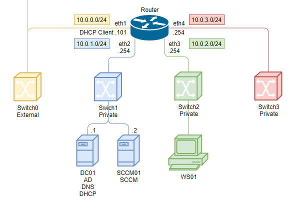
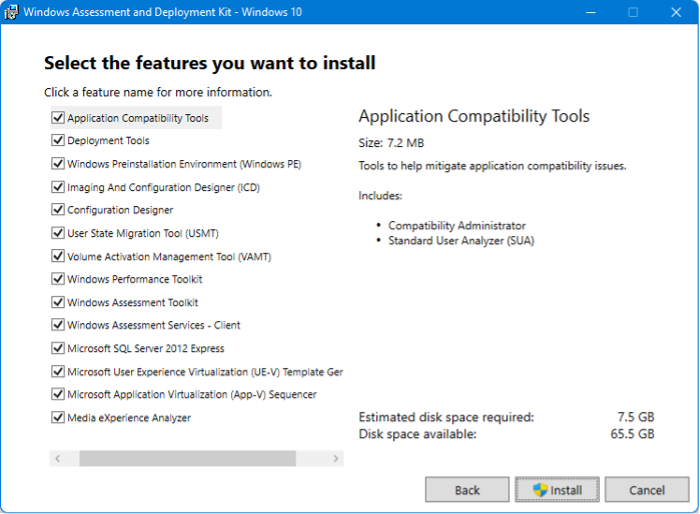
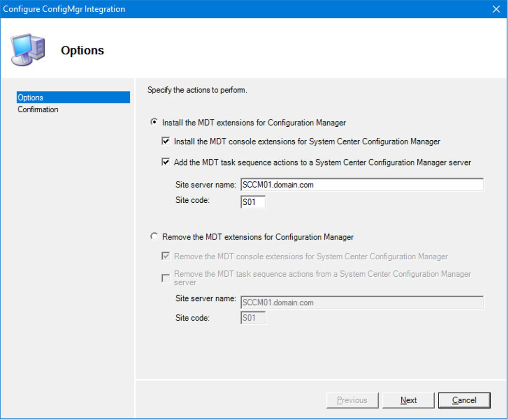
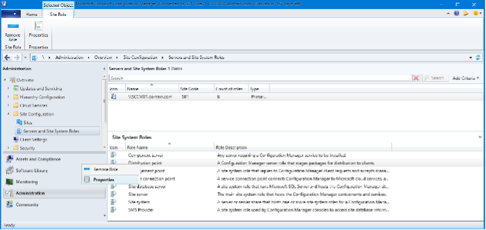
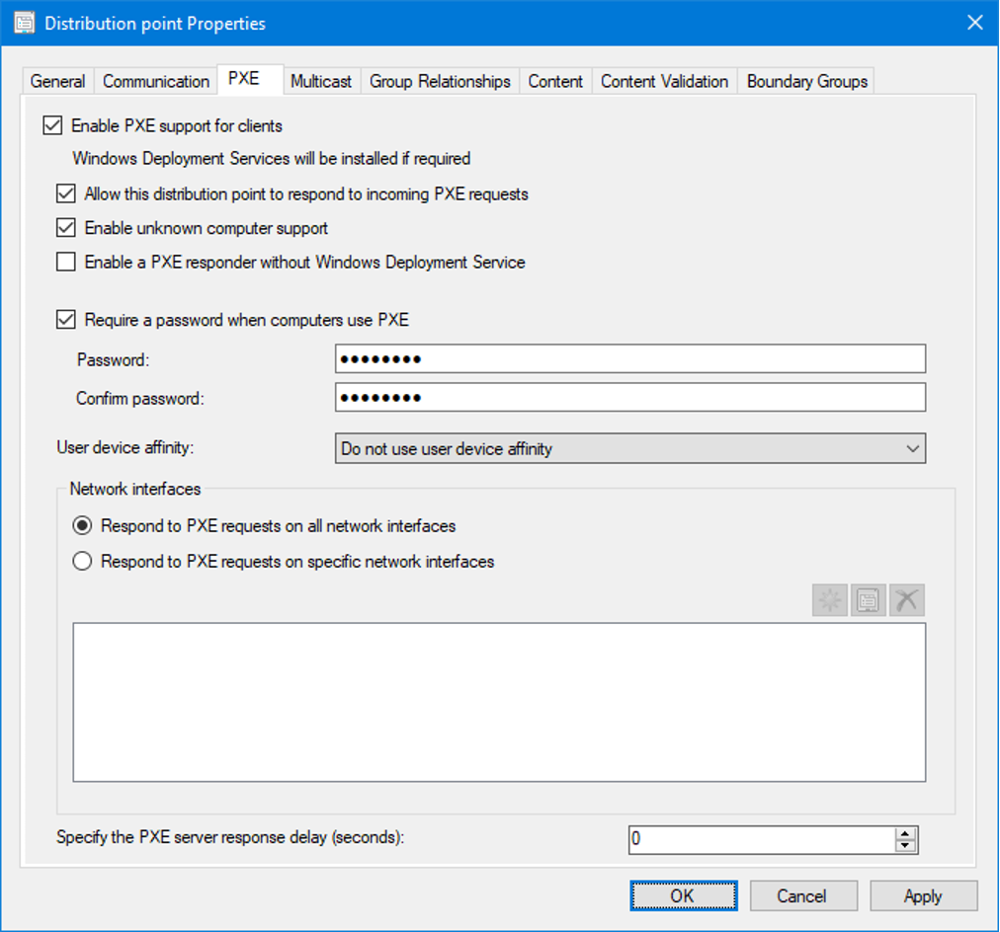
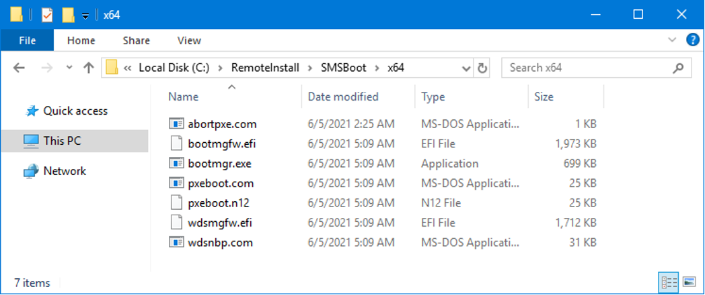
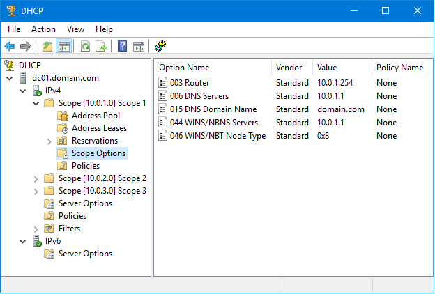
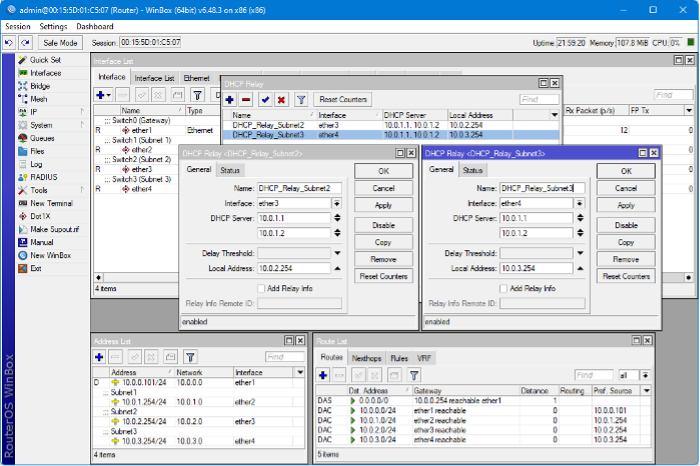

# Install PXE

## Install Windows ADK and Windows PE



Для работы с образами Windows необходимо на сервер SCCM установить Windows Windows Assessment and Deployment Kit и Windows Preinstallation Environment. Они опубликованы на официальном сайте Microsoft.

Установочные файлы позволяют скачать и выполнить установку без подключения к интернету.

Обязательные компоненты для установки:

- Deployment Tools
- Windows Preinstallation Environment (Windows PE)



## Install and integration Microsoft Deployment Toolkit (MDT)

Для расширения консоли **Configuration Manager**, установите **MDT** с настройками по умолчанию на сервере SCCM.

Запустите приложение **Configure ConfigMgr Integration** и выполните интеграцию. Будут добавлены мастера и шаблоны.



## Enable PXE

Для включения **Preboot Execution Environment** перейдите в свойства **Distribution point**.



- **Enable PXE support for clients** - для включения функции загрузки по сети. Windows Deployment Services будет установлен если не выбрана опция Enable a PXE responder without Windows Deployment Service и если он ещё не установлен.
- **Allow this distribution point to respond to incoming PXE requests** – разрешить этой точке дистрибуции отвечать на запросы PXE.
- **Enable unknown computer support** – отвечать на запросы машин которых нет в базе CM. Например, новый компьютер на который нужно установить корпоративный образ Windows.
- **Enable a PXE responder without Windows Deployment Service** – включение службы «ConfigMgr PXE Responder Service» для работы без роли WDS. Не будет доступен мультикаст. Не будет папки RemoteInstall.
- **Require a password when computers use PXE** – включение ввода пароля если нужно ограничить доступ пользователям к этой функции. Запрос будет выполняться после загрузки Boot image, но до выбора Task sequence.



Будет включена роль **WDS** и сервер будет готов принимать запросы от клиентов. О завершении процесса можно узнать из файла `C:\Program Files\Microsoft Configuration Manager\Logs\distmgr.log`

В директориях `C:\RemoteInstall\SMSBoot\x64` и `C:\RemoteInstall\SMSBoot\x86` будет создано по семь файлов. Они используются **WDS**, не **ConfigMgr PXE Responder**.



<table>
    <tr>
        <th></th>
        <th>x86 и x64 BIOS</th>
        <th>x64 UEFI и IA64 UEFI</th>
        <th></th>
    </tr>
    <tr>
        <td>Требует нажатия F12 для продолжения загрузки PXE</td>
        <td>pxeboot.com</td>
        <td>bootmgfw.efi</td>
        <td>Версия EFI PXEboot.com или PXEboot.n12 (в EFI выбор между загрузкой PXE обрабатывается внутри оболочки EFI, а не NBP). Bootmgfw.efi является эквивалентом объединения функциональных возможностей PXEboot.com, PXEboot.n12, abortpxe.com и bootmgr.exe.</td>
    </tr>
    <tr>
        <td>Немедленно начинает загрузку PXE</td>
        <td>pxeboot.n12</td>
        <td></td>
        <td></td>
    </tr>
    <tr>
        <td>Позволяет устройству немедленно начать загрузку с помощью следующего загрузочного устройства, указанного в BIOS. Это позволяет устройствам, которые не должны загружаться с использованием PXE, немедленно начать процесс загрузки, не дожидаясь тайм-аута.</td>
        <td>abortpxe.com</td>
        <td></td>
        <td></td>
    </tr>
    <tr>
        <td></td>
        <td>bootmgr.exe</td>
        <td></td>
        <td></td>
    </tr>
    <tr>
        <td>Обнаружение архитектуры. Сценарии ожидающих устройств</td>
        <td>wdsnbp.com</td>
        <td>wdsmgfw.efi</td>
        <td>Обработчики, предлагающие пользователю нажать клавишу для продолжения загрузки PXE. Сценарии ожидающих устройств</td>
    </tr>
</table>

- **bootmgfw.efi** – Windows boot manager для UEFI;
- **bootmgr.exe** – Windows boot manager для BIOS;
- **pxeboot.com** – Инициирует требование нажать клавишу F12 для начала загрузки образа. Это сообщение отправляется сервером SCCM PXE при развертывании Task Sequence как Available;
- **pxeboot.n12** – Для этого файла не требуется нажимать F12. Это сообщение отправляется сервером SCCM PXE при развертывании Task Sequence как Required. Для его использования нужно переименовать в `pxeboot.com`;
- **wdsmgfw.efi** – NBP файл для UEFI;
- **wdsnbp.com** – NBP файл для BIOS.

### Сценарий загрузки PXE

1. Клиент направляется для загрузки **wdsnbp.com** сервером;
2. **wdsnbp.com** проверяет пакет ответа PXE и продолжает загрузку **pxeboot.com**;
3. **pxeboot.com** загружает **bootmgr.exe** и данные конфигурации загрузки **Boot Configuration Data**. Хранилище **BCD** должно находиться в каталоге `\Boot` в корневой папке TFTP;
4. **bootmgr.exe** считывает записи операционной системы **BCD**, загружает **boot.sdi** и **winpe.wim**;
5. **bootmgr.exe** начинает загрузку **Windows PE** с вызова **winload.exe** в образе **winpe.wim**.

## Enable role DHCP

Для работы PXE необходим работающий DHCP сервер. Назначим на нём три области для выдачи адресов в разных подсетях `10.0.1.101-200`, `10.0.2.101-200` и `10.0.3.101-200`. Укажем адрес шлюза и сервер имен в каждой области.



## Network settings

### Сценарий подключения клиентов

1. Клиентский компьютер передает широковещательный пакет DHCP, который запрашивает адрес DHCP и PXE серверов;
2. DHCP-сервер отвечает, посылая широковещательный пакет, который сообщает клиенту, что это адресный сервер;
3. PXE-сервер отвечает клиенту и сообщает, что это загрузочный сервер;
4. Клиент отправляет запрос на DHCP-сервер для запроса IP-адреса;
5. DHCP-сервер отправляет IP-адрес клиенту;
6. Клиент посылает запрос на сервер PXE для запроса пути к программе сетевой загрузки (NBP);
7. PXE-сервер отвечает, посылая путь NBP;
8. Клиент загружает и запускает NBP.

Это работает в пределах одной подсети. Для других нужно настроить пересылку пакетов клиента на известный адрес DHCP и PXE сервера.

Например, так это делается на MikroTik. Адрес PXE сервера `10.0.1.2` указывается и для DHCP.



Для Cisco используется:

```bat
ip helper-address <ip DHCP server>
ip helper-address <ip WDS server>
ip forward-protocol udp 4011
```

Что если для этого будут использоваться опции DHCP?

- В опции 67 можно указать только один параметр и для других архитектур и режимов указать другой образ не получится. DHCP сервер не может определить архитектуру, BIOS или UEFI;
- После определения архитектуры и предоставления нужного образа PXE предлагает нажать F12 для продолжения. В случае с опцией DHCP машина будет всегда загружаться по сети пока не будет отключена функция в BIOS или UEFI;
- Если вы не знаете какая очередность загрузки выставлена на компьютерах организации, то не беспокойтесь – найдутся те, которые загрузятся по сети не предоставив выбора;
- [Microsoft does not support the use of these options on a DHCP server to redirect PXE clients](https://docs.microsoft.com/en-US/troubleshoot/windows-server/networking/pxe-clients-not-start-dhcp-60-66-67-option);
- [Boot from a PXE server on a different network - Configuration Manager | Microsoft Docs](https://docs.microsoft.com/en-us/troubleshoot/mem/configmgr/boot-from-pxe-server).

## Additional components

### State migration point (SMP)

Точка миграции состояний. Точка миграции состояния используется для хранения данных миграции состояния пользователя во время сценариев замены компьютера.

### Distribution point (DP)

Точка распространения. Точка распространения используется для хранения всех пакетов в Configuration Manager, включая пакеты, связанные с развертыванием операционной системы.

### Software update point (SUP)

Точка обновления программного обеспечения. Точка обновления программного обеспечения, которая обычно используется для развертывания обновлений на существующих машинах, также может использоваться для обновления операционной системы как часть процесса развертывания. Также можно использовать автономное обслуживание для обновления образа непосредственно на сервере Configuration Manager.

### Reporting services point

Точка службы отчетов. Точка служб отчетов может использоваться для мониторинга процесса развертывания операционной системы.

### Boot images

Загрузочные образы. Загрузочные образы - это образы предустановочной среды Windows (Windows PE), используемые диспетчером конфигурации для запуска развертывания.

### Operating system images

Образы операционной системы. Пакет образов операционной системы содержит только один файл, пользовательский WIM-образ. Обычно это образ производственного развертывания.

### Drivers

Драйверы. Как и MDT Lite Touch, Configuration Manager также предоставляет репозиторий (каталог) драйверов управляемых устройств.

### Task sequences

Последовательности задач. Последовательности задач в Configuration Manager выглядят и ощущаются как последовательности в MDT Lite Touch, и они используются для тех же целей. Однако в Configuration Manager последовательность задач доставляется клиентам в виде политики через точку управления (MP). MDT предоставляет в Configuration Manager дополнительные шаблоны последовательности задач. Пакет для оценки и развертывания Windows (ADK) для Windows 10 также необходим для поддержки управления и развертывания Windows 10.

## Create Boot image

Когда клиент загружается через PXE, то CM предоставляет образ загрузки. Он подбирается исходя из архитектуры машины. Если загрузочный образ с точной архитектурой недоступен, CM использует образ с совместимой архитектурой.

### Сценарий выбора загрузочного образа

1. CM находит системную запись, соответствующую MAC-адресу или SMBIOS клиента, который пытается загрузить.
2. CM определяет список последовательностей задач развернутых для этого клиента.
3. В списке задач выбирается образ загрузки, соответствующий архитектуре клиента. Если загрузочный образ найден для этой архитектуры, то он загружается. Если обнаружено несколько соответствующих образов, то используется указанный в той последовательности задач, которая имеет наивысший идентификатор развертывания (создана последней). Если иерархия включает несколько сайтов, то приоритет назначается по алфавиту (у старшей буквы приоритет выше). Например, ZZZ имеет приоритет над AAA независимо от даты разворачивания.
4. Если загрузочный образ для архитектуры не найден, то определяется совместимый с архитектурой клиента. Он ищется в списке последовательностей задач найденных на шаге 2. Например, клиенты x64 с BIOS и MBR совместимы с x32 и x64 образами. Клиенты x32 с BIOS и MBR совместимы только с x32 образами. Клиенты x64 с UEFI совместимы только с x64 образами, а клиенты x32 с UEFI совместимы только с x32 образами.

Перейти в свойства Boot image и установить галочку «Deploy this boot image from the PXE-enabled distribution point» для использования образа PXE

## Problems

### Boot Image x86 for Windows 11 (x64)

Почему-то при создании Boot Image выполняется поиск файлов в `C:\Program Files (x86)\Windows Kits\10\Assessment and Deployment Kit\Windows Preinstallation Environment\x86`. Эта архитектура не поддерживается новыми образами Windows 11. Нужно вручную создать этот каталог и cкопировать в нее содержимое amd64. `C:\Program Files (x86)\Windows Kits\10\Assessment and Deployment Kit\Windows Preinstallation Environment\amd64`

### VBSCRIPT in Windows PE 23H2

В версии Windows PE 23H2 удалена поддержка VBSCRIPT, но он нужен для работы MDT Toolkit.

[Инструкция по добавлению](https://www.deploymentresearch.com/fixing-vbscript-support-in-windows-adk-sep-2023-update-build-25398/)

В момент установки этого пакета на любом Windows 10/11 скопировать пакеты (4 файла .cab) из `C:\Windows\SoftwareDistribution\Download`.

Для удобства можно сохранить в архив для будущих новых образов.

`Microsoft-Windows-VBSCRIPT-FoD-Package.zip`

Скопировать пакеты в директорию `C:\Program Files (x86)\Windows Kits\10\Assessment and Deployment Kit\Windows Preinstallation Environment`.

Пакеты en-us скопировать в `C:\Program Files (x86)\Windows Kits\10\Assessment and Deployment Kit\Windows Preinstallation Environment\amd64\WinPE_OCs`.

Остальные в директорию `C:\Program Files (x86)\Windows Kits\10\Assessment and Deployment Kit\Windows Preinstallation Environment\amd64\WinPE_OCs\en-us`.

С помощью MDT сгенерировать новый Boot Image и в мастере создания для добавления в образ поставить галки обоим пакетам.
