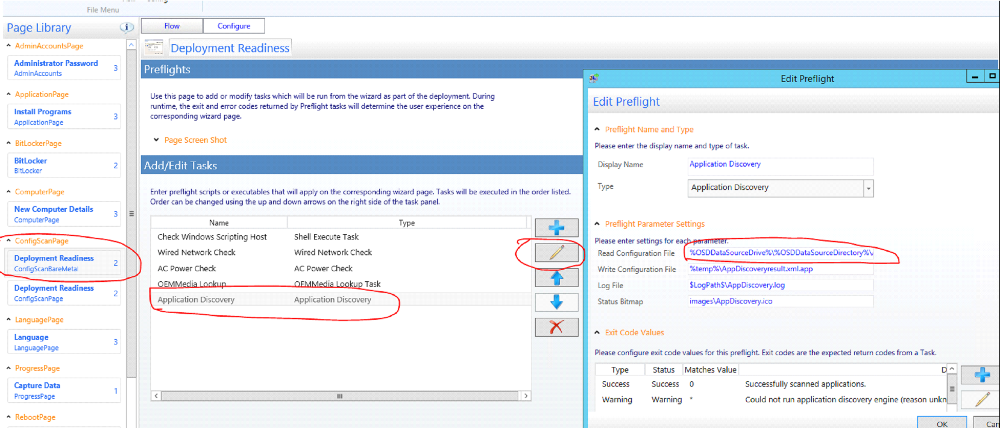

# UDI Wizard

## Application Discovery Error

Edit via UDI Wizard **Read Configuration File** in Application Discovery check `%OSDDataSourceDrive%\%OSDDataSourceDirectory%\AppDiscoveryresult.xml.app` to `%DeployRoot%\Scripts\UDIWizard_Config.xml.app`



## Wizard

Task Sequences created with MDT should opened only with installed MDT Toolkit.

UI Designer PXE (Run as Administrator) `C:\Program Files\Microsoft Deployment Toolkit\Bin\UDIDesigner.exe`. Edit file `%DeployRoot%\Scripts\UDIWizard_Config.xml`

Software Settings: `%temp%\AppDiscoveryresult.xml.app` `APPLICATION` `PACKAGES`

Site Settings: `servername` `DSPA OSD UDI`

## Preview wizard

```bat
"C:\Program Files\Microsoft Deployment Toolkit\Templates\Distribution\Tools\x64\OSDSetupWizard.exe" /preview /xml:"%DeployRoot%\Scripts\UDIWizard_Config.xml"
```

## Wizard Config

Manage variables in Task Sequence. In `UDIWizard_Config.xml` variables are specified, which are filled in at the beginning:

- OSDDomainName_1
- OSDDomainOUName_1
- OSDJoinAccount_1
- OSDJoinPassword_1

This variables are created as a step (Add/General/Set TS Variables) and specified in Task Sequence, so that when they are changed, it is not necessary to edit `UDIWizard_Config.xml`.

In UDIWizard they are specified as `%OSDDomainName_1%`.

For specifying multiple OS in `xml`, several OSDImageName (variable) with names are specified. In Task Sequence, each step with an image is added a TS Variable condition.

## Add Image to Wizard

OS images must be added to the display list in UDI Wizard. `VolumePage - Image Combo Box`

* **Image Name** must match the **OSDImageName** variable set in the Task Sequence at the **Install** stage for each image. In each step of the image installation in the Task Sequence, a variable check is implemented. Thus, the selected image will be installed.

**Index** - the number of the version in the image (Home, Edu, Pro etc.)

After making changes to `UDIWizard_Config.xml` and saving, you need to **Update Distribution Points** for the **MDT ToolKit** package (Console - Packages - MDT).
